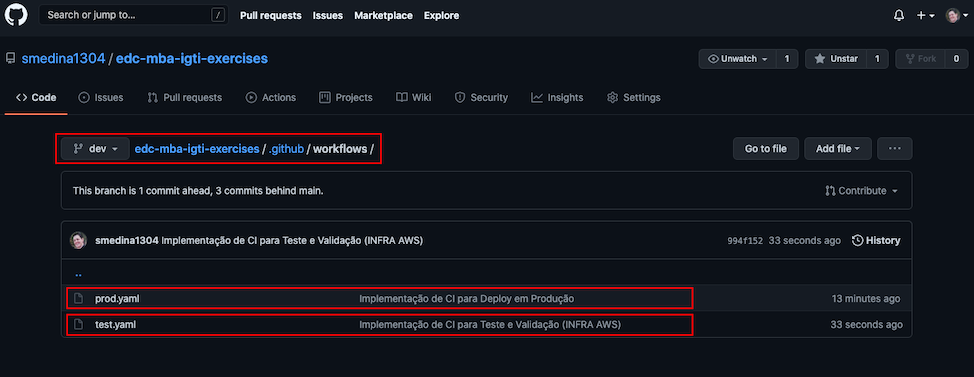
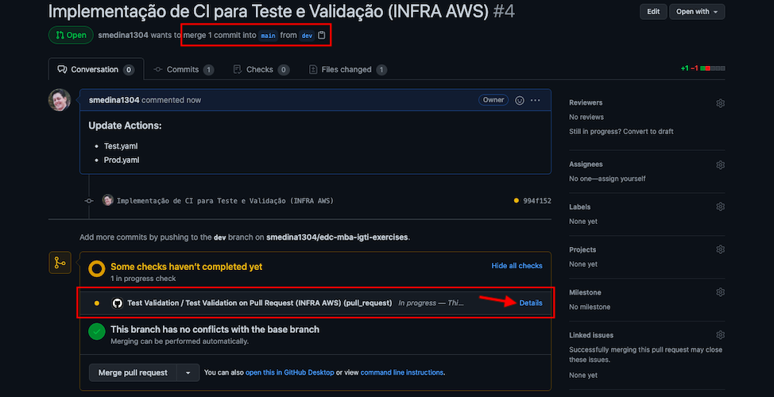
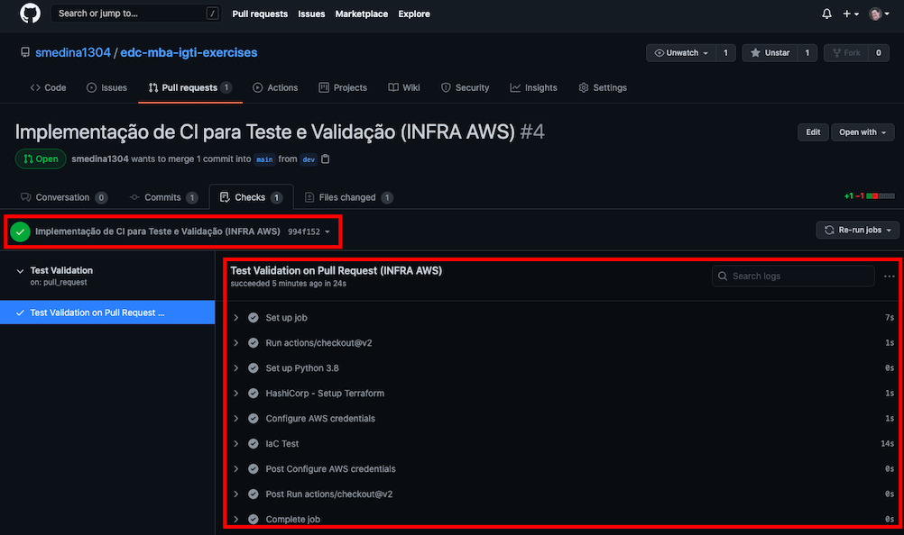
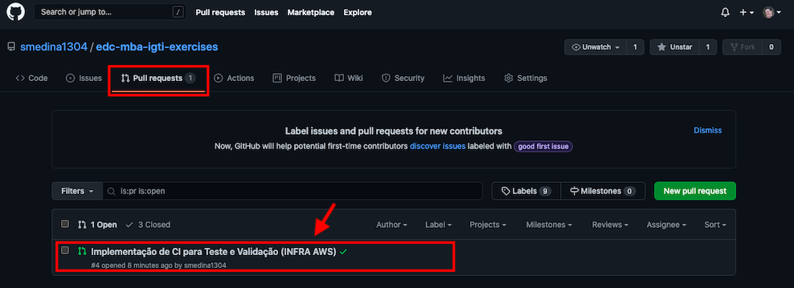
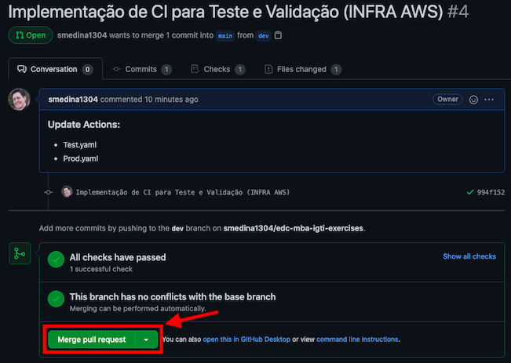
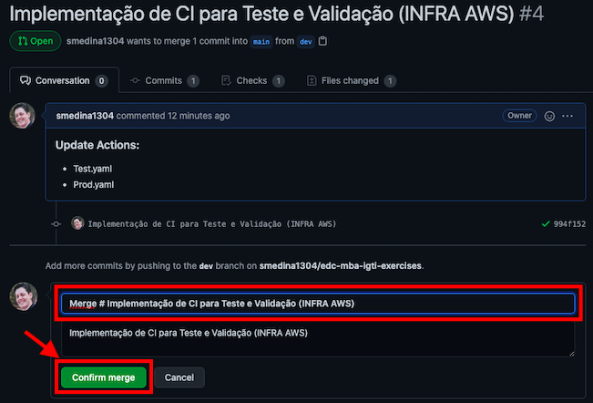
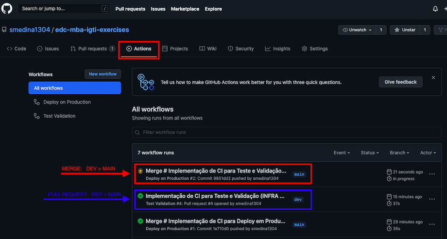
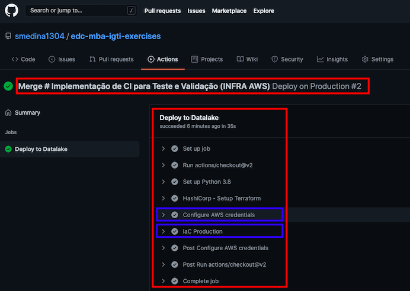
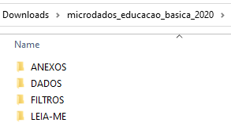
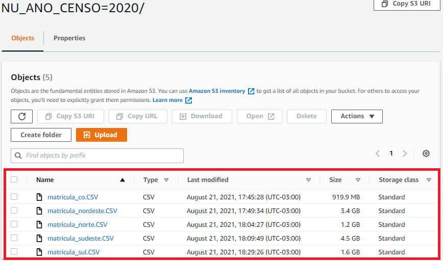

# edc-mba-igti-exercises
Exercícios dos Módulos do MBA IGTI - Engenheiro de Dados Cloud

## Módulo 01

### Desafio-Mod-01:
<br>

`ATENÇÃO:`
*Toda a infraestrutura em nuvem deve ser implantada utilizando o Terraform (ou outra solução de IaC de sua escolha) e esteiras de deploy no Github (ou Gitlab, ou Bitbucket, ou outro de sua escolha).*
<br>
<br>

`Preparação da Infraestrutura em Nuvem:`
*Utilizando IaC com esteira de Deploy no Github.*
<br><br>

**Terraform Scripts**
<br>

Toda infraestrutura para esta etapa foi criada utilizando o Terraform, e os scripts estão na pasta: `mod-01/infraestrutura` com os arquivos separados por recurso ou funcionalidade.
<br><br>

Definição do Provedor AWS e definição da Pasta e Bucket para armazenamento do controle de estado dos recursos feito pelo Terraform:
<br>

Source: `mod-01/infraestrutura/provider.tf`
<br><br>

Parametros e definições para criação bucket S3 para o DataLake:
<br>

Source: `mod-01/infraestrutura/s3.tf`
<br><br>

Definição dos codigos python/pyspark para serem copiados para o DataLake:
<br>

Source: `mod-01/infraestrutura/s3_files.tf`
<br><br>

Declaração das variáveis utilizada nos scripts Terraform:
<br>

Source: `mod-01/infraestrutura/variables.tf`
<br><br><br>

Foram executados os procedimento com o Terraform para validar os scripts:
<br>

```console
terraform init

terraform fmt

terraform validate

terraform plan
```
<br>
<br>


**Github Actions - Criando e Executando uma Esteira para `Test` e `Deploy`**
<br>

Conforme a documentação padrão para criação de `Flows` para as `Actions` no Github, foram criados dois fluxos:

**Pasta: `.github/workflows`**
- test.yaml 
    É executado no momento de um `Pull Request` entre uma branch de desenvolvimento com a principal chamada `Main`, e realiza toda a verificação de infraestrutura antes de efetivar as ações.

- prod.yaml
    É executado no momento do `Merge`, após a verificação do `Pull Request` finalizado. Após o `Merge` confirmado o fluxo é executado para efetivamente disponibilizar os recursos de infra definidos no script.

<br>
<p align="left">
   
</p>

<br>
<br>

Após criar o `Pull Request` entre os branches `DEV` e `MAIN`, o processo definido no fluxo `test.yaml` é executado e pode ser acompanhado ou verificado, acessando a opção `Detalhes`.
<br>
<p align="left">
   
</p>
<br>
<br>

Ao entrar em detalhes podemos ver o que foi executado em cada passo do fluxo definido na esteira para testes do processo de infra.
<br>
<p align="left">
   
</p>
<br>
<br>

Finalizando a primeira para que é a verificação feita pelo *pull*, devemos seguir para a ação de *merge* onde temos que acessar pela aba `Pull Requests`, e percorrendo a lista de requests `Open` que foram realizadas anteriormente, selecionar a desejada e verificar os detalhes.

<br>
<p align="left">
   
</p>
<br>
<br>

Estando com o estado apto realizar o *merge*, deve ser selecionado a opção `Merge pull request`, para iniciar a confirmação de atualização da branch `Main`.

<br>
<p align="left">
   
</p>
<br>
<br>

Verifique o Texto ou Defina a descrição que será registrada na atualização, e Confirme para efetivar o processo.
<br>
<p align="left">
   
</p>
<br>
<br>

Na Aba `Actions`, é possível verificar e acompanha todos os fluxos que foram e estão sendo executados nas trigges definidas nas açãoes de `Pull Request` e `Push`.
<br>
<p align="left">
   
</p>
<br>
<br>

Acessando o fluxo que foi executado o *merge*, podemos verificar todos os detalhes e logs do processo.
<br>
<p align="left">
   
</p>
<br>
<br>

**Atividades**
<br>

1- Realizar a ingestão dos dados do Censo Escolar 2020 no AWS S3 ou outro storage de nuvem de sua escolha. Dados disponíveis em: `https://www.gov.br/inep/ptbr/acesso-a-informacao/dados-abertos/microdados/censo-escolar`. O método de ingestão é livre. Os dados devem ser ingeridos na zona raw ou zona crua ou zona 
bronze do seu Data Lake. 
<br>
<br>

- Etapa de Download realizada localmente pelo código python: `mod-01\sources\mod01-desaf-item1-download.py`
<br>
<p align="left">
   
</p>
<br>

- Etapa de Uploading realizada localmente pelo código python: `mod-01\sources\mod01-desaf-item1-ingestao.py`
<br>

``` python
python .\mod01-desaf-item1-ingestao.py
Definindo Client S3.
Lendo os arquivos.

Uploading [iniciando]: .\Downloads\microdados_educacao_basica_2020\DADOS\matricula_co.CSV.
.\Downloads\microdados_educacao_basica_2020\DADOS\matricula_co.CSV  964540264 / 964540264.0  (100.00%)
Uploading [finalizado]: matricula_co.CSV


Uploading [iniciando]: .\Downloads\microdados_educacao_basica_2020\DADOS\matricula_nordeste.CSV.
.\Downloads\microdados_educacao_basica_2020\DADOS\matricula_nordeste.CSV  3640506175 / 3640506175.0  (100.00%)
Uploading [finalizado]: matricula_nordeste.CSV


Uploading [iniciando]: .\Downloads\microdados_educacao_basica_2020\DADOS\matricula_norte.CSV.
.\Downloads\microdados_educacao_basica_2020\DADOS\matricula_norte.CSV  1268838221 / 1268838221.0  (100.00%)
Uploading [finalizado]: matricula_norte.CSV


Uploading [iniciando]: .\Downloads\microdados_educacao_basica_2020\DADOS\matricula_sudeste.CSV.
.\Downloads\microdados_educacao_basica_2020\DADOS\matricula_sudeste.CSV  4843869303 / 4843869303.0  (100.00%)
Uploading [finalizado]: matricula_sudeste.CSV


Uploading [iniciando]: .\Downloads\microdados_educacao_basica_2020\DADOS\matricula_sul.CSV.
.\Downloads\microdados_educacao_basica_2020\DADOS\matricula_sul.CSV  1714681857 / 1714681857.0  (100.00%)
Uploading [finalizado]: matricula_sul.CSV


Fim.
```
<br>
<p align="left">
   
</p>
<br>
<br>

2- Utilizar alguma tecnologia de Big Data para transformar os dados no formato parquet
e escrevê-los na zona staging ou zona silver do seu Data Lake.
<br>

- Executar no Glue o job via código python\pyspark: `mod-01\sources\mod01-desaf-item2-aws-glue-job_spark.py`

<br>

3- Fazer a integração com alguma engine de Data Lake. No caso da AWS, você deve:
a. Configurar um Crawler para a pasta onde os arquivos na staging estão 
depositados;
b. Validar a disponibilização no Athena.

<br>

4- Caso deseje utilizar o Google, disponibilize os dados para consulta usando o Big 
Query. Caso utilize outra nuvem, a escolha da engine de Data Lake é livre.

<br>

5- Use a ferramenta de Big Data ou a engine de Data Lake (ou o BigQuery, se escolher 
trabalhar com Google Cloud) para investigar os dados e responder às perguntas do 
desafio.

<br>

6- Quando o desenho da arquitetura estiver pronto, crie um repositório no Github (ou 
Gitlab, ou Bitbucket, ou outro de sua escolha) e coloque o código IaC para a 
implantação da infraestrutura. Nenhum recurso deve ser implantado 
manualmente

