# edc-mba-igti-exercises
Exercícios dos Módulos do MBA IGTI - Engenheiro de Dados Cloud

## Módulo 02
<br>

### Trabalho prático e Desafio:
<br>
<br>

#### **Desenho Proposto:**
<br>

<p align="left">
   
</p>
<br>
<br>
<br>

#### **Recursos utilizados:**

- Pacotes python - verificar no arquivo `requirements.txt`
- Instalar:
   - AWS CLI version 2 - https://docs.aws.amazon.com/cli/latest/userguide/install-cliv2.html 
   - EKS - eksctl - https://docs.aws.amazon.com/eks/latest/userguide/eksctl.html
      - Também deve ser verificado de juntamente com o eksctl foi instalando kubectl, caso contrário verificar o procedimento em: https://docs.aws.amazon.com/eks/latest/userguide/install-kubectl.html 
   - HELM - https://helm.sh/docs/intro/install/
   - kubectx - https://github.com/ahmetb/kubectx

- Verificar as instalações:
   ``` shell
   > aws --version
      aws-cli/2.2.31 Python/3.8.8 Darwin/19.6.0 exe/x86_64 prompt/off

   > eksctl version
      0.63.0

   > kubectl version
      Client Version: version.Info{Major:"1", Minor:"22", GitVersion:"v1.22.1", GitCommit:"632ed300f2c34f6d6d15ca4cef3d3c7073412212", GitTreeState:"clean", BuildDate:"2021-08-19T15:38:26Z", GoVersion:"go1.16.6", Compiler:"gc", Platform:"darwin/amd64"}

   > helm version
      version.BuildInfo{Version:"v3.6.3", GitCommit:"d506314abfb5d21419df8c7e7e68012379db2354", GitTreeState:"dirty", GoVersion:"go1.16.6"}

   ```
<br>
<br>

#### **Atividades:**
<br>

1- Crie um RDS Postgres que tenha acesso público liberado
<br>

2- Clonar o projeto https://github.com/carlosbpy/igti-k8s-exercise
<br>

3- Ingerir dados da tabela de customers para o postgres
<br>

4- DeployarEKS na AWS ou utilizar o Minikube
<br>

5- Migrar tabela de customers para a estrutura do Kafka
<br>

6- Realizar o processamento dos dados da tabela de customers utilizando o KsqlDB
<br>

7- Disponibilizar dados da tabela de customers em real timepara o Apache Pinot.
<br>
<br>

#### **Resolução:**
<br>

*Etapa 1:*
<br>

- Clonar o projeto https://github.com/carlosbpy/igti-k8s-exercise
<br>

- O conteúdo do exemplo do *igti-k8s-exercise* (acima) gerado pelo proferssor Carlos Barbosa, foi copiado para a pasta `/mod-02/igti-k8s-exercise` e será ajustado para o executar do trabalho prático. Deve ser analisado cada pasta para entendimento do conteúdo.
<br>

   - `api`: Pasta contém script para criação da tabela de origem e leitura dos dados no `postgres`, e um código `python` para carga de dados nesta tabela.
   - `infra`: Pasta com scripts sh, para chamada de comandos para enteração com o EKS para criação da infraestrutura para implementação no Apache Kafka, ksqldb e Pinot.
   - `incubator-pinot`: Pasta do Pinot para deploy no Kubernetes.
   - `kafka-strimzi-k8s-v1beta1`: Pasta do Kafka para deploy no Kubernetes.
   - `ksqldb-server`: Pasta do ksqldb para deploy no Kubernetes.
   - `pinot_schema_configuration`: Scripts para criação do schema e tabela no Pinot.


<br>

*Etapa 2:*
<br>

- Iniciando a criação do cluster via comandos (IaC).

   <p align="left">
      
   </p>
   <br>


   - Para inicar a criação dos servidores do cluster é necessário rodar o script `eks.sh`:
      ``` shell
         > cd ./mod-02/igti-k8s-exercise/infra
         
         > ./eks.sh 
         2021-08-29 17:58:16 [ℹ]  eksctl version 0.63.0
         2021-08-29 17:58:16 [ℹ]  using region us-east-2
         2021-08-29 17:58:17 [ℹ]  setting availability zones to [us-east-2a us-east-2b us-east-2c]
         2021-08-29 17:58:17 [ℹ]  subnets for us-east-2a - public:192.168.0.0/19 private:192.168.96.0/19
         2021-08-29 17:58:17 [ℹ]  subnets for us-east-2b - public:192.168.32.0/19 private:192.168.128.0/19
         2021-08-29 17:58:17 [ℹ]  subnets for us-east-2c - public:192.168.64.0/19 private:192.168.160.0/19
         2021-08-29 17:58:17 [ℹ]  nodegroup "ng-igtik8s" will use "" [AmazonLinux2/1.20]
         2021-08-29 17:58:17 [ℹ]  using Kubernetes version 1.20
         2021-08-29 17:58:17 [ℹ]  creating EKS cluster "igtik8s" in "us-east-2" region with managed nodes
         2021-08-29 17:58:17 [ℹ]  will create 2 separate CloudFormation stacks for cluster itself and the initial managed nodegroup
         2021-08-29 17:58:17 [ℹ]  if you encounter any issues, check CloudFormation console or try 'eksctl utils describe-stacks --region=us-east-2 --cluster=igtik8s'
         2021-08-29 17:58:17 [ℹ]  CloudWatch logging will not be enabled for cluster "igtik8s" in "us-east-2"
         2021-08-29 17:58:17 [ℹ]  you can enable it with 'eksctl utils update-cluster-logging --enable-types={SPECIFY-YOUR-LOG-TYPES-HERE (e.g. all)} --region=us-east-2 --cluster=igtik8s'
         2021-08-29 17:58:17 [ℹ]  Kubernetes API endpoint access will use default of {publicAccess=true, privateAccess=false} for cluster "igtik8s" in "us-east-2"
         2021-08-29 17:58:17 [ℹ]  2 sequential tasks: { create cluster control plane "igtik8s", 3 sequential sub-tasks: { wait for control plane to become ready, 1 task: { create addons }, create managed nodegroup "ng-igtik8s" } }
         2021-08-29 17:58:17 [ℹ]  building cluster stack "eksctl-igtik8s-cluster"
         2021-08-29 17:58:19 [ℹ]  deploying stack "eksctl-igtik8s-cluster"
         2021-08-29 17:58:49 [ℹ]  waiting for CloudFormation stack "eksctl-igtik8s-cluster"
         2021-08-29 17:59:20 [ℹ]  waiting for CloudFormation stack "eksctl-igtik8s-cluster"
         2021-08-29 18:00:20 [ℹ]  waiting for CloudFormation stack "eksctl-igtik8s-cluster"
         2021-08-29 18:01:21 [ℹ]  waiting for CloudFormation stack "eksctl-igtik8s-cluster"
         2021-08-29 18:02:22 [ℹ]  waiting for CloudFormation stack "eksctl-igtik8s-cluster"
         2021-08-29 18:03:23 [ℹ]  waiting for CloudFormation stack "eksctl-igtik8s-cluster"
         2021-08-29 18:04:23 [ℹ]  waiting for CloudFormation stack "eksctl-igtik8s-cluster"
         2021-08-29 18:05:24 [ℹ]  waiting for CloudFormation stack "eksctl-igtik8s-cluster"
         2021-08-29 18:06:25 [ℹ]  waiting for CloudFormation stack "eksctl-igtik8s-cluster"
         2021-08-29 18:07:25 [ℹ]  waiting for CloudFormation stack "eksctl-igtik8s-cluster"
         2021-08-29 18:08:26 [ℹ]  waiting for CloudFormation stack "eksctl-igtik8s-cluster"
         2021-08-29 18:09:27 [ℹ]  waiting for CloudFormation stack "eksctl-igtik8s-cluster"
         2021-08-29 18:13:33 [ℹ]  building managed nodegroup stack "eksctl-igtik8s-nodegroup-ng-igtik8s"
         2021-08-29 18:13:35 [ℹ]  deploying stack "eksctl-igtik8s-nodegroup-ng-igtik8s"
         2021-08-29 18:13:35 [ℹ]  waiting for CloudFormation stack "eksctl-igtik8s-nodegroup-ng-igtik8s"
         2021-08-29 18:13:52 [ℹ]  waiting for CloudFormation stack "eksctl-igtik8s-nodegroup-ng-igtik8s"
         2021-08-29 18:14:09 [ℹ]  waiting for CloudFormation stack "eksctl-igtik8s-nodegroup-ng-igtik8s"
         2021-08-29 18:14:29 [ℹ]  waiting for CloudFormation stack "eksctl-igtik8s-nodegroup-ng-igtik8s"
         2021-08-29 18:14:47 [ℹ]  waiting for CloudFormation stack "eksctl-igtik8s-nodegroup-ng-igtik8s"
         2021-08-29 18:15:07 [ℹ]  waiting for CloudFormation stack "eksctl-igtik8s-nodegroup-ng-igtik8s"
         2021-08-29 18:15:27 [ℹ]  waiting for CloudFormation stack "eksctl-igtik8s-nodegroup-ng-igtik8s"
         2021-08-29 18:15:47 [ℹ]  waiting for CloudFormation stack "eksctl-igtik8s-nodegroup-ng-igtik8s"
         2021-08-29 18:16:04 [ℹ]  waiting for CloudFormation stack "eksctl-igtik8s-nodegroup-ng-igtik8s"
         2021-08-29 18:16:22 [ℹ]  waiting for CloudFormation stack "eksctl-igtik8s-nodegroup-ng-igtik8s"
         2021-08-29 18:16:40 [ℹ]  waiting for CloudFormation stack "eksctl-igtik8s-nodegroup-ng-igtik8s"
         2021-08-29 18:16:56 [ℹ]  waiting for CloudFormation stack "eksctl-igtik8s-nodegroup-ng-igtik8s"
         2021-08-29 18:17:15 [ℹ]  waiting for CloudFormation stack "eksctl-igtik8s-nodegroup-ng-igtik8s"
         2021-08-29 18:17:16 [ℹ]  waiting for the control plane availability...
         2021-08-29 18:17:16 [✔]  saved kubeconfig as "/Users/sergiomedina/.kube/config"
         2021-08-29 18:17:16 [ℹ]  no tasks
         2021-08-29 18:17:16 [✔]  all EKS cluster resources for "igtik8s" have been created
         2021-08-29 18:17:17 [ℹ]  nodegroup "ng-igtik8s" has 2 node(s)
         2021-08-29 18:17:17 [ℹ]  node "ip-192-168-127-244.us-east-2.compute.internal" is ready
         2021-08-29 18:17:17 [ℹ]  node "ip-192-168-161-148.us-east-2.compute.internal" is ready
         2021-08-29 18:17:17 [ℹ]  waiting for at least 2 node(s) to become ready in "ng-igtik8s"
         2021-08-29 18:17:17 [ℹ]  nodegroup "ng-igtik8s" has 2 node(s)
         2021-08-29 18:17:17 [ℹ]  node "ip-192-168-127-244.us-east-2.compute.internal" is ready
         2021-08-29 18:17:17 [ℹ]  node "ip-192-168-161-148.us-east-2.compute.internal" is ready
         2021-08-29 18:19:27 [ℹ]  kubectl command should work with "/Users/sergiomedina/.kube/config", try 'kubectl get nodes'
         2021-08-29 18:19:27 [✔]  EKS cluster "igtik8s" in "us-east-2" region is ready
      ```
      
      Obs: serão criados incialmente dois nodes (servidores) inicialmente para compor o cluster.
      <br>

   - Acompanhar os logs reportados pelo script `eks.sh`, e também no `AWS CloudFormation > Stacks`.
   <br>

      <p align="left">
         
      </p>
      <br>

   - É muito importante observar as configurações de subnet para que as permissões sejam liberadas para conexão com a base Postgres.
   <br>

      ``` shell
         2021-08-29 17:58:17 [ℹ]  subnets for us-east-2a - public:192.168.0.0/19 private:192.168.96.0/19
         2021-08-29 17:58:17 [ℹ]  subnets for us-east-2b - public:192.168.32.0/19 private:192.168.128.0/19
         2021-08-29 17:58:17 [ℹ]  subnets for us-east-2c - public:192.168.64.0/19 private:192.168.160.0/19      
      ```

   - Assim que o script for finalizado verifique os logs para garantir que todos os recursos foram criados.

      <br>

      - `ATENÇÃO:` Sendo utilizanda uma conta Free Tier, e mediante ao uso anterior, o cluster pode não ser criado pelo número de IPs da VPC reservados anteriormente, porem veja abaixo o erro reportado, e como é possível resolver este problema e seguir com a criação do cluster.
         <br>

         - Erro reportado no `AWS CloudFormation > Stacks`.
            <br>

            <p align="left">
               
            </p>
            <br>

         - Erro reportado com o comando `eksctl`.
            <br>

            <p align="left">
               
            </p>
            <br>

         - Acessar `VPC` via console AWS.
            <br>

            <p align="left">
               
            </p>
            <br>

         - Acessar `VPC` via console AWS.
            <br>

            <p align="left">
               
            </p>
            <br>

   - Salvando localmente as configurações de acesso ao Cluster, utilizar o script `kube-config.sh`. Abaixo o conteúdo do script:
   <br>

      ``` shell
         > cat ./kube-config.sh
         #! /usr/bin/env bash

         eksctl utils write-kubeconfig -c igtik8s -r us-east-2

      ```

      <br>
      Executando.

      ``` shell
         > ./kube-config.sh    
         2021-08-29 18:32:13 [ℹ]  eksctl version 0.63.0
         2021-08-29 18:32:13 [ℹ]  using region us-east-2
         2021-08-29 18:32:14 [✔]  saved kubeconfig as "/Users/sergiomedina/.kube/config"

      ```

      `ATENÇÃO:` O arquivo com a configuração de acesso de todos os clusters acessíveis pelo seu usuário serão gravadas na pasta `[home]/.kube/config`.
   <br>
   <br>

   - Utilizar o `kubectx` para selecionar o contexto do cluster para interação dos comandos de preparação dos ambientes de aplicação, havendo apenas um o mesmo é selecionado automaticamente e mostrado abaixo, se houver mais que um, você deve utilizar as setas do teclado para selecionar qual o cluster desejado para interação.

      ``` shell
         > kubectx           
         sergio.medina@igtik8s.us-east-2.eksctl.io
      ```

      Verificando.
      
      ``` shell
         > kubectl get nodes    
         NAME                                            STATUS   ROLES    AGE   VERSION
         ip-192-168-127-244.us-east-2.compute.internal   Ready    <none>   27m   v1.20.7-eks-135321
         ip-192-168-161-148.us-east-2.compute.internal   Ready    <none>   27m   v1.20.7-eks-135321

         > kubectl get namespaces
         NAME              STATUS   AGE
         default           Active   37m
         kube-node-lease   Active   37m
         kube-public       Active   37m
         kube-system       Active   37m         
      ```

   <br>

   - Criando os namespaces necessários para organizar o deploy dos recursos no cluster.
   <br>

      ``` shell
         > kubectl create namespace ingestion
         namespace/ingestion created

         > kubectl create namespace processing
         namespace/processing created

         > kubectl create namespace datastorage
         namespace/datastorage created

         > kubectl get namespaces              
         NAME              STATUS   AGE
         datastorage       Active   4s
         default           Active   42m
         ingestion         Active   50s
         kube-node-lease   Active   42m
         kube-public       Active   42m
         kube-system       Active   42m
         processing        Active   16s
      ```

<br>

*Etapa 3:*
<br>

- Criando o servidor Postgres via RDS, seleção da versão e o modo free tier.
<br>

<p align="left">
   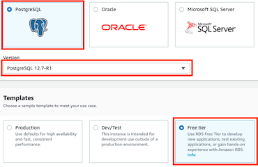
</p>
<br>

   - Definição do nome da instance, usuário e senha.
<p align="left">
   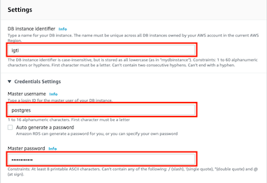
</p>
<br>

   - Caracteristica do Servidor.
<p align="left">
   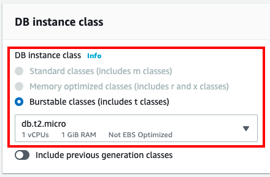
</p>
<br>

   - Storage.
<p align="left">
   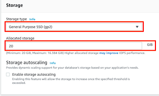
</p>
<br>

   - Configurações de Network.
<p align="left">
   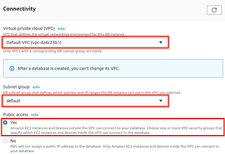
</p>
<br>

<p align="left">
   
</p>
<br>

   - Autenticação.
<p align="left">
   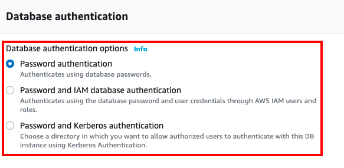
</p>
<br>

   - Opções adicionais.
<p align="left">
   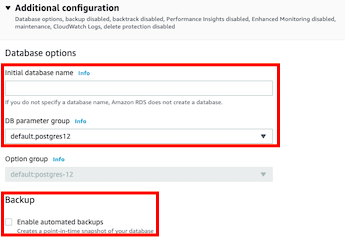
</p>
<br>

   - Backup.
<p align="left">
   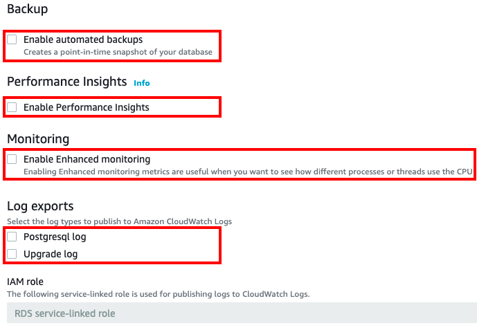
</p>
<br>

   - Manutenção.
<p align="left">
   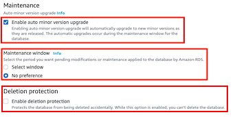
</p>
<br>


<br>

*Etapa 4:*
<br>

- Deploy de Serviço - Kafka Strimzi (https://strimzi.io/).
<br>
   - Para instalação Kafka Strimzi no cluster Kubernetes, usar o script:

      ``` shell
         > cd ./mod-02/igti-k8s-exercise/kafka-strimzi-k8s-v1beta1
         
         > ./install-strimzi-helm.sh

         [...]
         W0903 19:35:53.794882    4180 warnings.go:70] apiextensions.k8s.io/v1beta1 CustomResourceDefinition is deprecated in v1.16+, unavailable in v1.22+; use apiextensions.k8s.io/v1 CustomResourceDefinition
         W0903 19:35:54.032545    4180 warnings.go:70] apiextensions.k8s.io/v1beta1 CustomResourceDefinition is deprecated in v1.16+, unavailable in v1.22+; use apiextensions.k8s.io/v1 CustomResourceDefinition
         NAME: kafka
         LAST DEPLOYED: Aug 20 19:35:57 2021
         NAMESPACE: ingestion
         STATUS: deployed
         REVISION: 1
         TEST SUITE: None
         NOTES:
         Thank you for installing strimzi-kafka-operator-0.22.0

         To create a Kafka cluster refer to the following documentation.

         https://strimzi.io/docs/operators/latest/using.html#deploying-cluster-operator-helm-chart-str

      ```
   <br>

   - Verificar os dados mostrados no final da execução e verificar o `POD ingestion`.

      ``` shell
         kubectl get pods -n ingestion
         NAME                                        READY   STATUS    RESTARTS   AGE
         strimzi-cluster-operator-799b7d7596-c8zt6   1/1     Running   0          20m
      ```
   <br>
   <br>

   - Definição do Broker:
      ``` shell
         > cd ./mod-02/igti-k8s-exercise/kafka-strimzi-k8s-v1beta1

         > kubectl apply -f broker/broker.yml -n ingestion
         kafka.kafka.strimzi.io/igtiedh created
      ```
      
      Verificando.
      
      ``` shell
         > kubectl get pods -n ingestion                  
         NAME                                        READY   STATUS    RESTARTS   AGE
         igtiedh-entity-operator-7f9db4fb97-2hs2c    3/3     Running   0          62s
         igtiedh-kafka-0                             1/1     Running   0          88s
         igtiedh-zookeeper-0                         1/1     Running   0          2m7s
         igtiedh-zookeeper-1                         1/1     Running   0          2m7s
         igtiedh-zookeeper-2                         1/1     Running   0          2m7s
         strimzi-cluster-operator-799b7d7596-c8zt6   1/1     Running   0          51m
      ```

      Para ver logs de um `POD`, por exempo usar o comando abaixo:

      ``` shell
         > kubectl logs strimzi-cluster-operator-799b7d7596-c8zt6 -n ingestion
      ```
   <br>
<br>

*Etapa 5:*
<br>

- Criando a tabela no postgres e inserindo os primeiros dados.
<br>

   - Utilizar o script `mod-02/igti-k8s-exercise/api/customers.sql` para criação da tabela no postgres:
      <br>
      ``` sql
         CREATE TABLE public.customers (
            id serial NOT NULL,
            nome text NULL,
            sexo text NULL,
            endereco text NULL,
            telefone text NULL,
            email text NULL,
            foto text NULL,
            nascimento date NULL,
            profissao text NULL,
            dt_update timestamp NULL,
            CONSTRAINT customers_pkey PRIMARY KEY (id)
         );
      ```
      <br>

   - Utilizar o código python `mod-02/igti-k8s-exercise/api/insert_customers_postgres.py` para inserir dados na tabela.
      <br>
      ``` shell
         > cd ./mod-02/igti-k8s-exercise/api

         > python3 insert_customers_postgres.py -n 10
      ```
      <br>
   
<br>

*Etapa 6:*
<br>

- Deploy de Serviço - Kafka Connect.
<br>

   - Criando um repositório no ECR para deploy da imagem do Kafka Connect.
   <br>

      Executando o script:
      ``` shell
         > cd ./mod-02/igti-k8s-exercise/infra

         >./ecr.sh

      ```

      <br>

      Verificando o `AWS ECR`.

      <p align="left">
         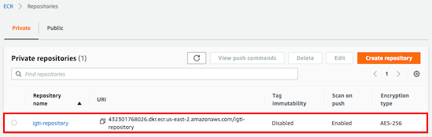
      </p>
      <br> 

      Atualizando o scrip `./build-img-strimzi.sh` com as instruções da `AWS`:
     <br>

     Selecionar a imagem.

      <p align="left">
         
      </p>
      <br>       

      Entrar em `View Commands`.
      <p align="left">
         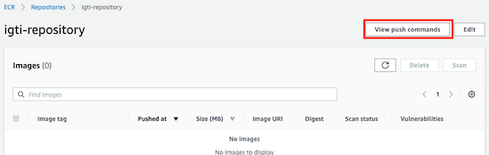
      </p>
      <br>       

      Verificar o OS.
      <p align="left">
         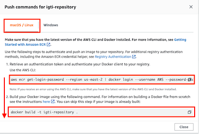
      </p>
      <br>       

      Copiar a lista de comandos na ordem definida, para ser executada.
      <p align="left">
         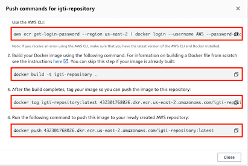
      </p>
      <br>       

      Executando o Build da imagem Docker:

      ``` shell
         > ./build-img-strimzi.sh

      ```

      Finalizando o script, e sendo apresentado a mensagem de sucesso, a imagem será mostrada na `AWS ECR`, dentro do repositório criado.

      <br>
      <p align="left">
         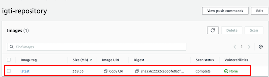
      </p>
      <br> 

      Atualizar a URI da imagem no arquivo `connect.yml`.

      <br>
      <p align="left">
         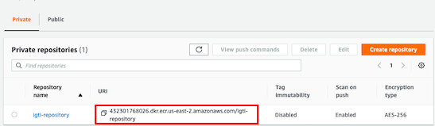
      </p>
      <br> 

      <p align="left">
         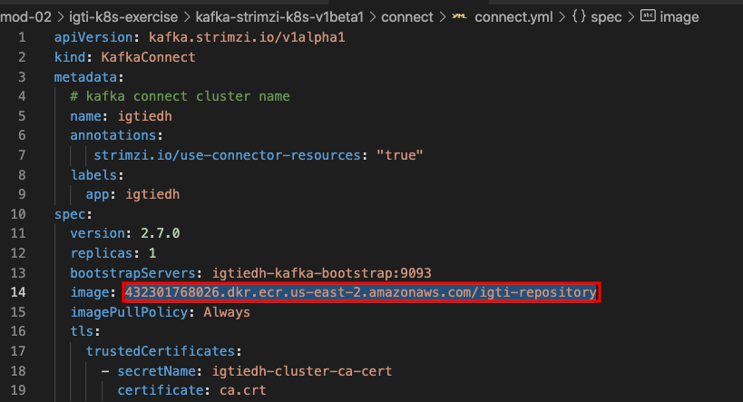
      </p>
      <br>

      Executando o deploy das configuração do Kafka Connect:
      <br>

      ``` shell
         > kubectl apply -f connect/connect.yml -n ingestion                  
         kafkaconnect.kafka.strimzi.io/igtiedh created
      ```

      Verificando.

      ``` shell
         > kubectl get pods -n ingestion                                      
         NAME                                        READY   STATUS    RESTARTS   AGE
         igtiedh-connect-554dfc4cc7-2mjzp            1/1     Running   0          114s
         igtiedh-entity-operator-7f9db4fb97-2hs2c    3/3     Running   0          3h51m
         igtiedh-kafka-0                             1/1     Running   0          3h51m
         igtiedh-zookeeper-0                         1/1     Running   0          3h52m
         igtiedh-zookeeper-1                         1/1     Running   0          3h52m
         igtiedh-zookeeper-2                         1/1     Running   0          3h52m
         strimzi-cluster-operator-799b7d7596-c8zt6   1/1     Running   0          4h41m
      ```
   <br>

*Etapa 7:*
<br>

- Deploy de Serviço - Kafka Topic.
<br>

   - Verificar as configurações do arquivo, `./topic/ingest-src-postgres-customers-json.yml`.

   - Estando ok, executar do deploy:

   ``` shell
      > kubectl apply -f topic/ingest-src-postgres-customers-json.yml -n ingestion 
      kafkaconnector.kafka.strimzi.io/ingest-src-postgresql-customers-json-3200e849928721 created

   ```

   Verificando.

   ``` shell

      > kubectl get kafkatopics -n ingestion
      NAME                                                                                               CLUSTER   PARTITIONS   REPLICATION FACTOR   READY
      connect-cluster-configs                                                                            igtiedh   1            1                    True
      connect-cluster-offsets                                                                            igtiedh   25           1                    True
      connect-cluster-status                                                                             igtiedh   5            1                    True
      consumer-offsets---84e7a678d08f4bd226872e5cdd4eb527fadc1c6a                                        igtiedh   50           1                    True
      src-postgres-customers-json                                                                        igtiedh   9            1                    True
      strimzi-store-topic---effb8e3e057afce1ecf67c3f5d8e4e3ff177fc55                                     igtiedh   1            1                    True
      strimzi-topic-operator-kstreams-topic-store-changelog---b75e702040b99be8a9263134de3507fc0cc4017b   igtiedh   1            1                    True


      > kubectl get kafkatopics src-postgres-customers-json -n ingestion
      NAME                          CLUSTER   PARTITIONS   REPLICATION FACTOR   READY
      src-postgres-customers-json   igtiedh   9            1                    True

      > kubectl get kafkatopics src-postgres-customers-json -n ingestion -o yaml
      apiVersion: kafka.strimzi.io/v1beta2
      kind: KafkaTopic
      metadata:
      creationTimestamp: "2021-09-04T03:27:52Z"
      generation: 1
      labels:
         strimzi.io/cluster: igtiedh
      name: src-postgres-customers-json
      namespace: ingestion
      resourceVersion: "41957"
      uid: c845857e-0db6-4e8b-8760-081cd4a16d49
      spec:
      config: {}
      partitions: 9
      replicas: 1
      topicName: src-postgres-customers-json
      status:
      conditions:
      - lastTransitionTime: "2021-09-04T03:27:52.432627Z"
         status: "True"
         type: Ready
      observedGeneration: 1

   ```

   Monitorando o Topic com `--from-beginning`.
   <br>

   ``` shell
   kubectl exec igtiedh-kafka-0 -n ingestion -c kafka -i -t -- bin/kafka-console-consumer.sh \
   --bootstrap-server localhost:9092 \
   --property print.key==true \
   --from-beginning \
   --topic src-postgres-customers-json
   ```

   Fazer simulações de envio, e depois comparar a quantidade de eventos recebidos no Kafka e os registrados na base de dados postgres.

   <br>

*Etapa 8:*
<br>

- Deploy de Serviço - Kafka Sink.
<br>

   - Verificar as configurações do arquivo, `./sink/bucket-s3.yml`.

   - Estando ok, executar do deploy:

   ``` shell
      > kubectl apply -f sink/bucket-s3.yml -n ingestion 
      kafkaconnector.kafka.strimzi.io/s3-sink-connector-igtiedh-9983717 created

   ```

   Monitorando o Topic com `--from-beginning`.
   <br>

   ``` shell
   kubectl exec igtiedh-kafka-0 -n ingestion -c kafka -i -t -- bin/kafka-console-consumer.sh \
   --bootstrap-server localhost:9092 \
   --property print.key==true \
   --from-beginning \
   --topic src-postgres-customers-json
   ```

   Fazer simulações de envio, e depois comparar a quantidade de eventos recebidos no Kafka e os registrados na base de dados postgres.
   <br>
   <br>

*Etapa 9:*
<br>

- Deploy de Serviço - KsqlDB.
<br>

   - Verificar as configurações do arquivo, `./ksqldb-server/repository/deployment`.
   <br>

   - Estando ok, executar do deploy:

   ``` shell
      > kubectl apply -f ./ksqldb-server/repository/deployment -n processing
      deployment.apps/ksqldb-server created
      service/ksqldb-headless created
      service/ksqldb-server created

   ```

   Verificando.

   ``` shell
      > kubectl get pods -n processing                                                             
      NAME                             READY   STATUS    RESTARTS   AGE
      ksqldb-server-5fd75cb5f7-sgdlj   1/1     Running   0          84s
   ```

   Acessando KsqlDB.

   ``` shell
      > kubectl exec ksqldb-server-5fd75cb5f7-sgdlj -n processing -i -t -- bash ksql               
      OpenJDK 64-Bit Server VM warning: Option UseConcMarkSweepGC was deprecated in version 9.0 and will likely be removed in a future release.
                        
                        ===========================================
                        =       _              _ ____  ____       =
                        =      | | _____  __ _| |  _ \| __ )      =
                        =      | |/ / __|/ _` | | | | |  _ \      =
                        =      |   <\__ \ (_| | | |_| | |_) |     =
                        =      |_|\_\___/\__, |_|____/|____/      =
                        =                   |_|                   =
                        =  Event Streaming Database purpose-built =
                        =        for stream processing apps       =
                        ===========================================

      Copyright 2017-2020 Confluent Inc.

      CLI v0.12.0, Server v0.12.0 located at http://localhost:8088
      Server Status: RUNNING

      Having trouble? Type 'help' (case-insensitive) for a rundown of how things work!

      ksql> 

   ```

   Mostrando os Topics disponíveis.

   ``` sql
      ksql> show topics;

      Kafka Topic                                             | Partitions | Partition Replicas 
      -------------------------------------------------------------------------------------------
      __strimzi-topic-operator-kstreams-topic-store-changelog | 1          | 1                  
      __strimzi_store_topic                                   | 1          | 1                  
      connect-cluster-configs                                 | 1          | 1                  
      connect-cluster-offsets                                 | 25         | 1                  
      connect-cluster-status                                  | 5          | 1                  
      default_ksql_processing_log                             | 1          | 1                  
      src-postgres-customers-json                             | 9          | 1                  
      -------------------------------------------------------------------------------------------
   ```

   Creando um Stream para consumir o dado. (src-postgres-customers-json.sql)

   ``` sql

      CREATE OR REPLACE STREAM ksql_stream_customers_json
      (
      "payload" STRUCT<"id" BIGINT,
                        "nome" VARCHAR,
                        "sexo" VARCHAR,
                        "endereco" VARCHAR,
                        "telefone" VARCHAR,
                        "email" VARCHAR,
                        "foto" VARCHAR,
                        "nascimento" VARCHAR,
                        "profissao" VARCHAR,
                        "dt_update" BIGINT,
                        "messagetopic" VARCHAR,
                        "messagesource" VARCHAR>
      )
      WITH (KAFKA_TOPIC='src-postgres-customers-json', VALUE_FORMAT='JSON');

      Message        
      ----------------
      Stream created 
      ----------------


      ksql> show streams;

      Stream Name                | Kafka Topic                 | Format 
      -------------------------------------------------------------------
      KSQL_PROCESSING_LOG        | default_ksql_processing_log | JSON   
      KSQL_STREAM_CUSTOMERS_JSON | src-postgres-customers-json | JSON   
      -------------------------------------------------------------------

   ```

   Utilizar o Stream criado e ler como uma tabela gerando um a output Topic.
   (output_ksqldb_stream_customers_json.sql)

   ``` sql

      CREATE OR REPLACE STREAM output_ksqldb_stream_customers_json
      WITH (KAFKA_TOPIC='output-ksqldb-stream-customers-json', PARTITIONS=3, VALUE_FORMAT='JSON')
      AS
      SELECT
      AS_VALUE("payload"->"id") as "business_key",
      "payload"->"id" as "id",
      "payload"->"nome",
      "payload"->"sexo",
      "payload"->"endereco",
      "payload"->"telefone",
      "payload"->"dt_update"
      FROM ksql_stream_customers_json
      EMIT CHANGES;

      Message                                                          
      ------------------------------------------------------------------
      Created query with ID CSAS_OUTPUT_KSQLDB_STREAM_CUSTOMERS_JSON_0 
      ------------------------------------------------------------------


   ksql> show queries;

   Query ID                                   | Query Type | Status    | Sink Name                           | Sink Kafka Topic                    | Query String                                                                                                                                                                                                                                                                                                                                                                                                                                                                                                                                                                                                                                                                                  
   --------------------------------------------------------------------------------------------------------------------------------------------------------------
   CSAS_OUTPUT_KSQLDB_STREAM_CUSTOMERS_JSON_0 | PERSISTENT | RUNNING:1 | OUTPUT_KSQLDB_STREAM_CUSTOMERS_JSON | output-ksqldb-stream-customers-json | CREATE OR REPLACE STREAM OUTPUT_KSQLDB_STREAM_CUSTOMERS_JSON WITH (KAFKA_TOPIC='output-ksqldb-stream-customers-json', PARTITIONS=3, REPLICAS=1, VALUE_FORMAT='JSON') AS SELECT   AS_VALUE(KSQL_STREAM_CUSTOMERS_JSON.`payload`->`id`) `business_key`,   KSQL_STREAM_CUSTOMERS_JSON.`payload`->`id` `id`,   KSQL_STREAM_CUSTOMERS_JSON.`payload`->`nome` `nome`,   KSQL_STREAM_CUSTOMERS_JSON.`payload`->`sexo` `sexo`,   KSQL_STREAM_CUSTOMERS_JSON.`payload`->`endereco` `endereco`,   KSQL_STREAM_CUSTOMERS_JSON.`payload`->`telefone` `telefone`,   KSQL_STREAM_CUSTOMERS_JSON.`payload`->`dt_update` `dt_update` FROM KSQL_STREAM_CUSTOMERS_JSON KSQL_STREAM_CUSTOMERS_JSON EMIT CHANGES; 
   --------------------------------------------------------------------------------------------------------------------------------------------------------------
   For detailed information on a Query run: EXPLAIN <Query ID>;


   ksql> show streams;

   Stream Name                         | Kafka Topic                         | Format 
   ------------------------------------------------------------------------------------
   KSQL_PROCESSING_LOG                 | default_ksql_processing_log         | JSON   
   KSQL_STREAM_CUSTOMERS_JSON          | src-postgres-customers-json         | JSON   
   OUTPUT_KSQLDB_STREAM_CUSTOMERS_JSON | output-ksqldb-stream-customers-json | JSON   
   ------------------------------------------------------------------------------------

   ```

   Queries de teste. (select_output_stream_customers.sql)

      OBS: se necessário definir para ler desde o primeiro registro executar o comando abaixo:
      ksql> set 'auto.offset.reset' =  'earliest';


   ``` sql
      -- QUERY 1
      SELECT
      "sexo",
      count("business_key") AS "qtd_por_sexo"
      FROM output_ksqldb_stream_customers_json
      GROUP BY "sexo"
      EMIT CHANGES;

      -- QUERY 2

      SELECT
      "id",
      "nome",
      "endereco",
      "telefone",
      "dt_update"
      FROM output_ksqldb_stream_customers_json
      EMIT CHANGES;
   ```


*Etapa 10:*
<br>

- Deploy de Serviço - Apache Pinot.
<br>

   - Executar o deploy do Pinot.

   ``` shell
      > cd ./mod-02/igti-k8s-exercise/incubator-pinot
      
      > . /deploy-pinot.sh
      "pinot" has been added to your repositories
      NAME: pinot
      LAST DEPLOYED: Sat Sep  4 02:15:24 2021
      NAMESPACE: datastorage
      STATUS: deployed
      REVISION: 1
      TEST SUITE: None

   ```

   - Listando os PODs.

   ``` shell
      kubectl get pods -A                                                         
      NAMESPACE     NAME                                        READY   STATUS    RESTARTS   AGE
      datastorage   pinot-broker-0                              0/1     Running   1          75s
      datastorage   pinot-controller-0                          1/1     Running   1          75s
      datastorage   pinot-minion-0                              1/1     Running   0          75s
      datastorage   pinot-server-0                              1/1     Running   1          75s
      datastorage   pinot-server-1                              1/1     Running   1          75s
      datastorage   pinot-zookeeper-0                           1/1     Running   0          75s
      ingestion     igtiedh-connect-554dfc4cc7-2mjzp            1/1     Running   0          120m
      ingestion     igtiedh-entity-operator-7f9db4fb97-2hs2c    3/3     Running   0          5h49m
      ingestion     igtiedh-kafka-0                             1/1     Running   0          5h50m
      ingestion     igtiedh-zookeeper-0                         1/1     Running   0          5h50m
      ingestion     igtiedh-zookeeper-1                         1/1     Running   0          5h50m
      ingestion     igtiedh-zookeeper-2                         1/1     Running   0          5h50m
      ingestion     strimzi-cluster-operator-799b7d7596-c8zt6   1/1     Running   0          6h40m
      kube-system   aws-node-548f6                              1/1     Running   0          8h
      kube-system   aws-node-x5jp9                              1/1     Running   0          8h
      kube-system   coredns-5c778788f4-6b6vl                    1/1     Running   0          8h
      kube-system   coredns-5c778788f4-tgzdr                    1/1     Running   0          8h
      kube-system   kube-proxy-l6bd4                            1/1     Running   0          8h
      kube-system   kube-proxy-v8k58                            1/1     Running   0          8h
      processing    ksqldb-server-5fd75cb5f7-sgdlj              1/1     Running   0          43m
   ```

   Configurando um Port Forwarding para acesso do Pinot.
   (./mod-02/igti-k8s-exercise/query-pinot-data.sh)
   <br>

   ``` shell 
      > ./query-pinot-data.sh 
   ```

   Assim que executado o script acima, será feito o direcionamento para porta 9000 no browser para acesso do Pinot.

   <br>
   <p align="left">
      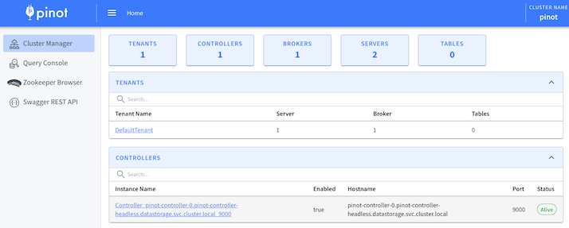
   </p>
   <br> 

   Executar o script para disponibilizar para o Pinota estrutura da tabela realtime que receberá os dados do kafka.

   ``` shell
      > cd mod-02/igti-k8s-exercise.
      
      > ./add-table-pinot.sh

         # Entrou no Pinot remotamente e vamos lista para ver se foi feito a cópia dos arquivo
         root@pinot-controller-0:/opt/pinot# ls -ls
         total 108
         24 -rw-r--r--  1 root root  24012 Sep  3 22:21 LICENSE
         32 -rw-r--r--  1 root root  28788 Sep  3 22:21 NOTICE
         0 drwxr-xr-x  1 root root     26 Sep  3 22:25 bin
         4 drwxr-xr-x  2 root root   4096 Sep  3 22:21 conf
         0 drwxr-xr-x  2 root root      6 Sep  3 22:21 configs
         4 -rw-r--r--  1  501 staff   607 Sep  4 05:42 customers-schema.json
         4 -rw-r--r--  1  501 staff  1103 Sep  4 05:42 customers-table.json
         0 drwxr-xr-x  2 root root      6 Sep  3 22:21 data
         0 drwxr-xr-x  4 root root     50 Sep  3 22:25 etc
         0 drwxr-xr-x  1 root root     20 Sep  3 22:25 examples
         36 -rw-r--r--  1 root root  36453 Sep  4 05:23 gc-pinot-controller.log
         0 drwxr-xr-x  2 root root     64 Sep  3 22:21 lib
         4 drwxr-xr-x  2 root root   4096 Sep  3 22:21 licenses
         0 drwxr-xr-x  2 root root     27 Sep  4 05:16 logs
         0 drwxr-xr-x 11 root root    246 Sep  3 22:21 plugins


         # A variavel de ambiente JAVA_OPTS deve ser sobrescrita como ""
         root@pinot-controller-0:/opt/pinot# echo $JAVA_OPTS
         -Xms256M -Xmx1G -XX:+UseG1GC -XX:MaxGCPauseMillis=200 -Xlog:gc*:file=/opt/pinot/gc-pinot-controller.log -Dlog4j2.configurationFile=/opt/pinot/conf/log4j2.xml -Dplugins.dir=/opt/pinot/plugins
         root@pinot-controller-0:/opt/pinot# JAVA_OPTS=""
         root@pinot-controller-0:/opt/pinot# echo $JAVA_OPTS

   ```

   Adicionando as tablelas no Pinot.

   ``` shell
      root@pinot-controller-0:/opt/pinot# cd bin
      root@pinot-controller-0:/opt/pinot/bin# ./pinot-admin.sh AddTable \
      > -schemaFile /opt/pinot/customers-schema.json \
      > -tableConfigFile /opt/pinot/customers-table.json \
      > -exec

      [...]

      {"status":"Table customers_REALTIME succesfully added"}

   ```

   Ver a tabela disponível no Pinot.
   <br>
   
   <p align="left">
      
   </p>
   <br>    


   Fazer simulações de envio, e depois comparar a quantidade de eventos recebidos no Kafka e os registrados na base de dados postgres.
   <br>
   <br>